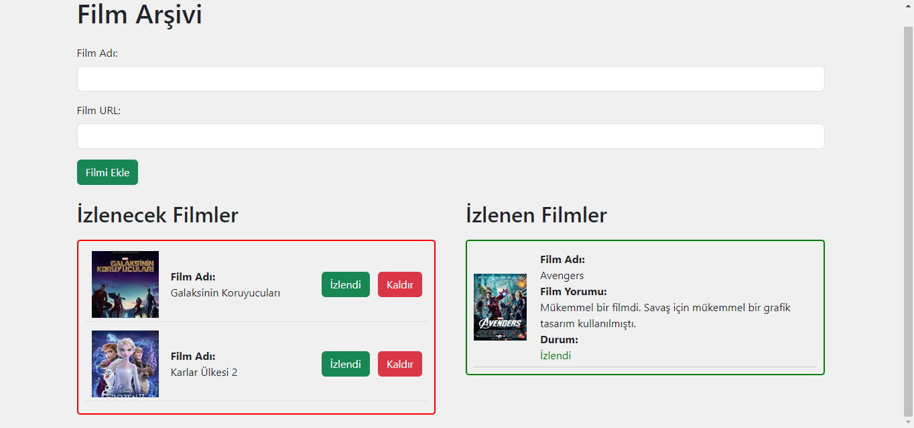

# Film Arşivi Projesi

* Ders kapsamında bir Film Arşivi projesi yapıldı.
* Bu projede Film ismi ve film resminin URL' si girilerek kaydedildiğinde izlenecek filmler listesine kaydetme işlemi yapıldı.
* İzlendi butonuna tıklandığında film hakkında görüşlerin yazılacağı bir MessageBox ekrana geldi.
* İzlendi dendikten sonra izlenen filmler listesine film resmi, film ismi, film hakkındaki görüşler ve filmin izlenme durumu javascript ile ekrana çekildi.
* Projede film hakkında görüşlerimizi yazarken iptal butonuna tıkladığımızda yorumlar null olarak kaydedliyordu. Bu düzeltildi.
  
# Projenin Ekran Görüntüsü

  

